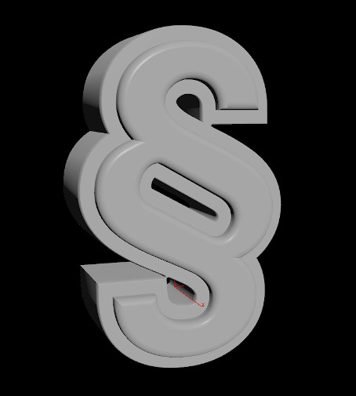

# Generate 3D glyphs HDA


## Intro
Rendering complex 3D texts (with bevelling and character offset) in real-time might be a problem in case you are using a framework that lacks such features. However you can use Houdini to pre-generate 3D glyphs, save them to disk (along with some useful data) and then load them on demand in real-time application. This gives you freedom to tweak bevelling and offset of characters without worrying about breaking geometry thanks to Houdini top-notch SOPs.

## Usage
1. In order to get all glyphs available for specific font, use python script. (fonttools are required)
    ```
    python get_font_glyphs.py /path/to/font.ttf
    ```
2. Place `text_to_3d.hda` to otl directory or install it in Houdini using *Assets / Install Assets Library...*
3. Open `demo.hiplc` to get better understanding of hda usage. Feel free to take a look at sample data generated by this tool located in `sample` folder.

## Notes
- Make sure to have *Add Text Attributes* enabled and *Hole Faces* disabled on input **Font SOP**. Its text should be set to all wanted glyphs (glyphs can't repeat).
    - Larger tracking is used in order to make sure expanded characters won't intersect their neighbours.
- Use separate **text_to_3d** node for each look variation.
- *show_single* parameter shows individual centered glyphs. Navigate trough them using timeline.
- One variation is used as master in terms of glyph centering. Use *move_by_data* parameter to reference its positioning for all other variations.
    - In case each variation has its glyphs centered by their bounding boxes, actual position of glyphs might differ between variations. Using *move_by_data* solves this problem.
- *geo_suffix_id* parameter sets suffix for each variation of output alembic files.
- `metadata.json` contains width and height information that could be later used in real-time applications.
    - Each glyph is saved by its Unicode code point (integer representing the Unicode glyph). When developing real-time application, one could easily convert desired string to series of Unicode code points (for example using `ord()` function in Python) and load corresponding alembic file for each glyph. By utilizing width and height values, glyphs could be arranged one next to another (without unnecessary gaps).
- When I was working on this HDA, Houdini 18 (featuring new **Polybevel** with collision detection) was not yet available. Therefore I have created some “fixes” to overcome common issues of geometry intersections when using bevelling. It wasn’t ideal, but it solved majority of problems and eventually worked quite good. These could be found in *Fixes tab*.
    - HDA is now updated to work with new **Polybevel** in Houdini 18, but these fixes are still used in order to lower bevelling collisions.
    - **Polybevel** collision detection in Houdini 18 works great, but there might be a case when beveling is terminated too soon due to *Offset Front Colliding with Itself*. In such case it might be desirable to disable collision detection and let **Boolean** fix the geometry. See following pictures for comparison.

With collision detection   |  Without collision detection
:-------------------------:|:-------------------------:
  |  